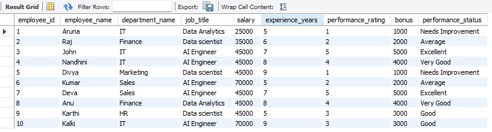
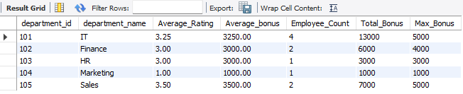
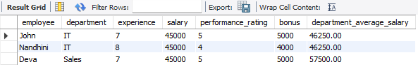
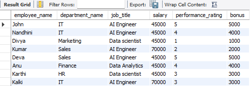

# Employee Salary Analysis using MySQL

## Project Overview

Business-oriented SQL project that analyzes employee salary, department, job, and performance data using MySQL to generate HR insights.

A relational database was designed with multiple tables and analyzed using SQL concepts such as JOINs, Aggregate Functions, Common Table Expressions (CTEs), Window Functions, Subqueries, Stored Procedures, and Temporary Tables.

The project focuses on generating meaningful business insights from employee salary and performance data.

---

## Database Schema

The database consists of the following tables:

- Department
- Jobs
- Employees
- Performance

### Relationships

- One Department can have many Employees.
- One Job can be assigned to many Employees.
- Each Employee has one Performance record.

---

## SQL Concepts Demonstrated

- Primary Keys
- Foreign Keys
- INNER JOIN
- Aggregate Functions
- GROUP BY
- HAVING
- Subqueries
- Common Table Expressions (CTEs)
- Window Functions
- CROSS JOIN
- CASE Statements
- Stored Procedures
- Temporary Tables

---

# Business Problems Solved

## Salary Analysis

- Calculate total employee count.
- Department-wise Employee Count
- Calculate department-wise average salary.
- Calculate department-wise salary expenditure.
- Find employees earning above the company average salary.
- Find employees earning above their department average salary.

---

## Window Function Analysis

- Highest-paid employee in each department.
- Second highest-paid employee in each department.
- Top two highest-paid employees in each department.

---

## Performance Analytics

- Employees with excellent performance and above-average bonus.
- Department-wise performance summary.
---

### Employee Master Report

A consolidated HR report displaying:

- Employee Name
- Department
- Job Title
- Salary
- Experience
- Performance Rating
- Bonus
- Performance Status

using multiple table JOINs and CASE statements.

---

## Stored Procedure

Developed a reusable stored procedure to generate employee reports based on a minimum salary provided by the HR manager.

### Concepts Used

- Stored Procedure
- Input Parameters
- INNER JOIN
- WHERE Clause

---

## Temporary Table

Created a temporary table to identify employees eligible for promotion based on:

- Performance Rating ≥ 4
- Experience ≥ 5 years
- Salary less than or equal to department average salary

### Concepts Used

- Temporary Tables
- Derived Tables
- Aggregate Functions
- INNER JOIN

---

## Tools Used

- MySQL Workbench
- MySQL 8
- GitHub

---

## Learning Outcomes

Through this project, I gained hands-on experience in:

- Designing relational databases
- Writing optimized SQL queries
- Performing business-oriented data analysis
- Solving HR analytics use cases
- Using advanced SQL features such as CTEs, Window Functions, Stored Procedures, and Temporary Tables

---

## Future Enhancements

- Connect the MySQL database to Power BI
- Build an interactive HR Analytics Dashboard
- Perform advanced KPI analysis

---
## Project Screenshots

### Employee Master Report

---

### Department-wise Performance Summary

---

### Promotion Eligibility Report

---

### Stored Procedure Output

## Author

**Shanmathi Sampath**

Aspiring Data Analyst | MySQL | Excel | Power BI

